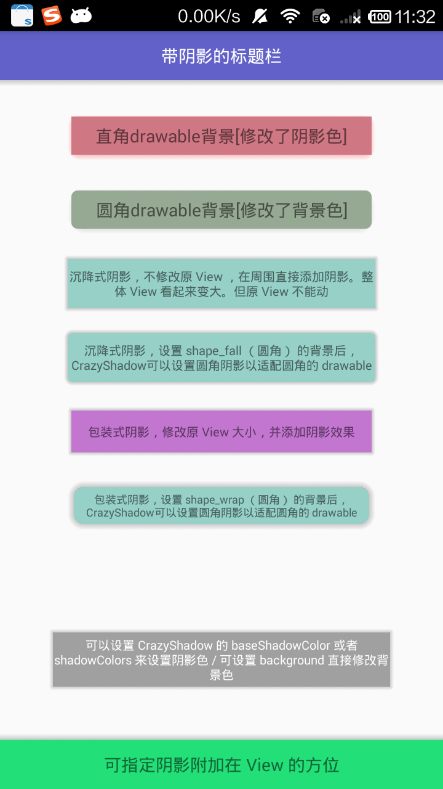

# CrazyShadow

说明：<br/>
   CrazyShadow 是一个专门为 View 添加阴影效果的库。
   设计 CrazyShadow 主要是因为自己一直想为最近编写的 [SpinMenu](https://github.com/Hitomis/SpinMenu)
与 [ThumbnailMenu](https://github.com/Hitomis/ThumbnailMenu) 还有将要完成的 [ActivitySwitch](https:
//github.com/Hitomis/ActivitySwitcher) 添加阴影效果，之前在网上一直没有找到合适的可以用的参考案例。所以只能
自己去编写这样一个 library。

   而在实际运用在，发现理想总是丰满的，现实很骨感。虽然可以实现优美的效果以及多功能性，但是使用场景比较单一：只能
为传统的矩形UI（即最终显示效果）添加阴影。为什么结果会是这样呢？大家都知道，一个 View 显示的模型肯定是一个矩形，不
管如何自定义 View 都有 left、top、right、bottom 以及 width、height 等一些概念，而这些概念也定位了 View 的模
型必定为一个矩形。所以 阴影效果的添加依据模型必定也是一个矩形。

   虽然有了很多限制，我想既然都做了，还是尽自己最大努力吧，目前 CrazyShadow 支持三种方式为 View 添加阴影效果。

1. wrap : 以包装 View 的方式添加阴影效果。改方式会改变 View 的大小。因为如果保持 View 大小不变同时又在 View四周添加了阴影，那么 View 的尺寸定会比之前大，这样可能会引起 View 周围其他 View 的位置变化。

2. fall : 以 View 的根视图（DecorView 中的 FrameLayout） 中添加一层阴影效果。不过因为与 View 不在一个布局层面上，所以当发生用户交互使原 View 的位置发生改变后，阴影还是会留在原来的位置。此种方式只能在位置不会发生改变的 View 上使用。慎用啊

3. drawable : 直接创建一个附带阴影效果的矩形（支持圆角）作为 View 的 background。

# Preview



# Import

导入 cslibrary Module 中的 作为依赖库，后期看情况是否上传到 Jcenter

# Usage
    ​```
        new CrazyShadow.Builder()
                .setContext(this)
                .setDirection(CrazyShadowDirection.ALL)
                .setShadowRadius(dip2Px(3))
                .setCorner(dip2Px(5))
                .setBackground(Color.parseColor("#96a993"))
                .setImpl(CrazyShadow.IMPL_DRAW)
                .action(findViewById(R.id.relay_draw1));
    ​```

更多示例代码可以查看 [MainActivity](https://github.com/Hitomis/CrazyShadow/blob/master/app/src/main/java/com/hitomi/crazyshadow/MainActivity.java)

# Attribute
| 属性 | 说明 |
| :--: |  :--: |
| impl | 以何种方式添加阴影，支持 wrap、fall、drawable 三种方式 |
| baseShadowColor | 阴影的基本颜色，即最深的颜色，与 colors 表示为y同一个作用， 如果baseShadowColor 与 colors 都不设置，阴影会使用默认颜色|
| background | 修改 View 的背景色，如果使用 drawable 方式添加阴影，那么该属性必须添加 |
| colors | 绘制阴影时需要的一个颜色由深到浅且长度为3的数组, 该属性与 baseShadowColor 起同一个作用，如果单单只设置 baseShadowColor 也会自动转换成为 colors  |
| corner | 阴影顶点的内侧弧度。以适配被设置的 View 是圆角的情况， 对使用 drawable 方式设置阴影时，该属性表示为圆角矩形背景的圆角角度 |
| shadowRadius | 阴影大小 |
| direction | 设定阴影在 View 上显示的方位， 支持的方位详情可以查看 [CrazyShadowDirection](https://github.com/Hitomis/CrazyShadow/blob/master/cslibrary/src/main/java/com/hitomi/cslibrary/base/CrazyShadowDirection.java) |

#Licence
Copyright 2016 Hitomis, Inc.

Licensed under the Apache License, Version 2.0 (the "License");
you may not use this file except in compliance with the License.
You may obtain a copy of the License at

   http://www.apache.org/licenses/LICENSE-2.0

Unless required by applicable law or agreed to in writing, software
distributed under the License is distributed on an "AS IS" BASIS,
WITHOUT WARRANTIES OR CONDITIONS OF ANY KIND, either express or implied.
See the License for the specific language governing permissions and
limitations under the License.
 


